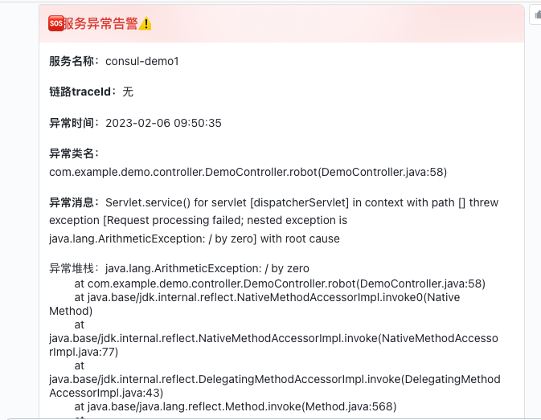
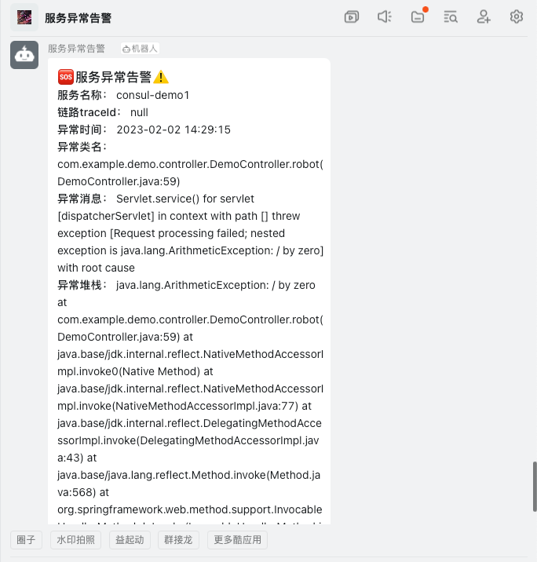
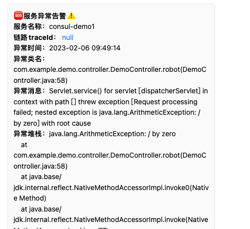

# robot-message-alert-starter
> 基于logback实现错误日志发送告警

# 引入依赖
```
<dependency>
    <groupId>io.github.osinn</groupId>
    <artifactId>robot-message-alert-starter</artifactId>
    <version>1.1</version>
</dependency>
```

# 配置
```
robot:
  alert:
    config:
      # 是否启用
      enabled: true
      # 机器人类型
      robot-type: FLY_TALK
      # 项目名称
      app-name: ${spring.application.name}
      # 签名密钥
      secret: 签名密钥(可选，安全设置签名效验必须要配置)
      # 机器人token，对应平台Webhook 地址token或key
      token: 钉钉token
      limit-stack-content-length: 500 # 异常栈信息长度
      # 基于guava限流配置
      limiter:
        acquire: 1
        permits-per-second: 1
      # 发送告警日志级别
      alert-level:
        - ERROR
        - WARN
      # 排除异常类，多个以逗号分割
      exclude-throwable-classes: RuntimeException,ArithmeticException
      # 排除包路径，多个以逗号分割
      exclude-package: com.example.demo1,com.example.demo2
```
### 配置示例
```
# 钉钉机器人, https://oapi.dingtalk.com/robot/send?access_token=钉钉token
robot:
  alert:
    config:
      enabled: true
      robot-type: DING_TALK
      app-name: ${spring.application.name}
      secret: 签名密钥(安全设置签名效验需要配置)
      token: 钉钉token
      limiter:
        acquire: 1
        permits-per-second: 1

# 飞书机器人，https://open.feishu.cn/open-apis/bot/v2/hook/飞书token
robot:
  alert:
    config:
      enabled: true
      robot-type: FLY_TALK
      app-name: ${spring.application.name}
      secret: 签名密钥(安全设置签名效验需要配置)
      token: 飞书token
      limiter:
        acquire: 1
        permits-per-second: 1
      alert-level:
        - ERROR
        - WARN

# 企微机器人，https://qyapi.weixin.qq.com/cgi-bin/webhook/send?key=企微token
robot:
  alert:
    config:
      enabled: true
      robot-type: wx_talk
      app-name: ${spring.application.name}
      token: 企微token
      limiter:
        acquire: 1
        permits-per-second: 1

```

# 示例
- 飞书机器人消息



- 钉钉机器人消息



- 企业微信机器人消息


